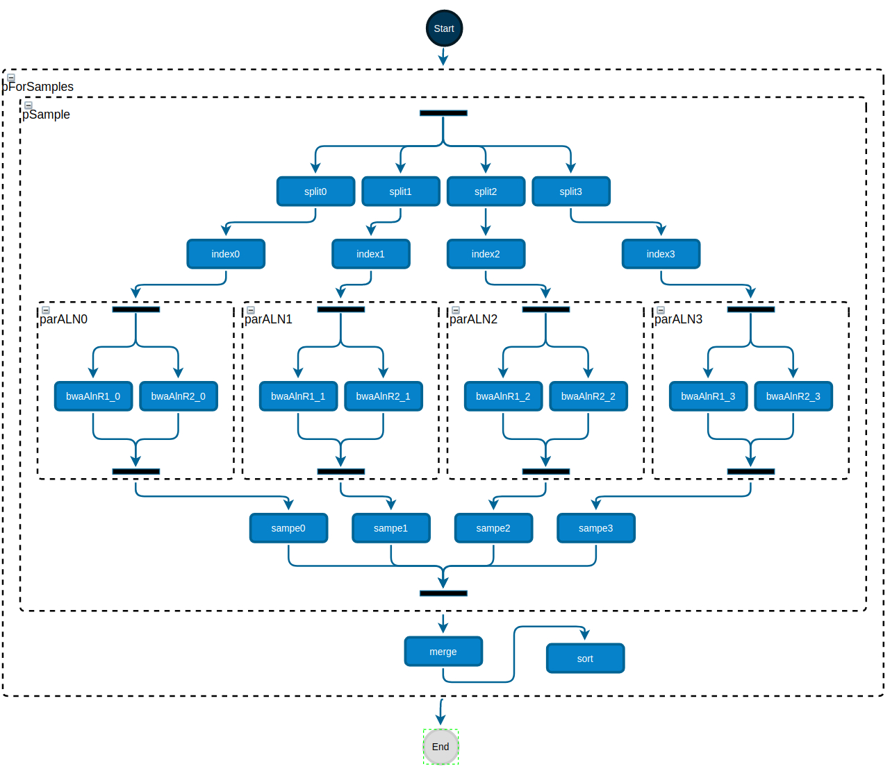
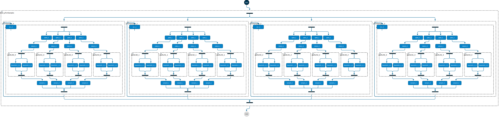

# FaaST: Public Demo Version

## System requirements

- JDK 11 (necessary)
- Gradle > 7.4 (tested with 7.4)

## Short description

This repository contains a version of FaaST, which runs without requiring the whole AFCL tech-stack. 
While the full version utilizes a database server, to retrieve metadata information about the available function types (FT),
its correspoding deployments (FD) and important scheduling information like
average round trip time (avgRTT), this version is configured to retrieve this information from 
static files located in [metadata](metadata).

The used setup provides you with an environment which is easy to set up (without requiring a separate DB) and is able to deliver
reproducable results. 

The class [ScheduleInvoker](src/main/java/at/ac/uibk/ScheduleInvoker.java) represents the Main of this Java program
and can be used to further customize input and output files.
By default, the input file is ```BWAfaast4_afcl.yaml```, the output file ```BWAfaast4_cfcl.yaml``` and as Scheduler 
the proposed ```FaaST``` is chosen. The loop is assumed to have 60 iterations. 
Note, that by changing the field ```ALGRORITHM``` in [ScheduleInvoker](src/main/java/at/ac/uibk/ScheduleInvoker.java) 
to ```Random```, a random scheduler is chosen.

## Installation and Execution

```shell
git clone https://github.com/pgritsch/faast_public.git && cd faast_public
```

```shell
gradle clean build
```

```shell
java -jar build/libs/afcl_published-1.0-IEEE.jar
```

## Example Workflow - BWA
For BWA see [https://doi.org/10.1093/bioinformatics/btp698](https://doi.org/10.1093/bioinformatics/btp698)

### Input file (full file see [BWAfaast4_afcl.yaml](BWAfaast4_afcl.yaml))

Note that no resource is defined, on where to execute the given function, but just the function type (FT) ```splitType```

#### Yaml Representation

```yaml
parallelBody:
   - section:
       - function:
           name: "split0"
           type: "splitType"
           dataIns:
             - name: "fastaFolder"
               type: "string"
               source: "pSample/fastaFolder"
             ### further inputs omitted for brevity ###
             - name: "chunks"
               type: "number"
               source: "pSample/chunks"
           dataOuts:
             - name: "fasta"
               type: "string"
```
#### Graphical Representation (created with [http://fceditor.dps.uibk.ac.at:8180/#/editor](http://fceditor.dps.uibk.ac.at:8180/#/editor))



### Output file

#### Yaml Representation

Note that after scheduling the ```resource``` property is filled with an IBM cloud function. 

Additionally, the name has an appended subscript. 
This is because the inner parallel is splitted again to allow for each segment to be executed on different resources.
(see the graphical depiction with 4 separate branches, where each of the branches runs on a different resource configuration).

```yaml
parallelBody:
  - section:
    - function:
        name: "split0_0"
        type: "splitType"
        dataIns:
        - name: "fastaFolder"
          type: "string"
          source: "pSample_0/fastaFolder"
        ### further inputs omitted for brevity ###
        - name: "chunks"
          type: "number"
          source: "pSample_0/chunks"
        dataOuts:
        - name: "fasta"
          type: "string"
        properties:
        - name: "resource"
          value: "https://eu-gb.functions.appdomain.cloud/api/v1/web/office%40dps.uibk.ac.at_dev/bwa/split.json"
```

#### Graphical Representation 



## StoreLess

In order to also consider the data transfer of the workflow and schedule the data storage buckets as well, the `StoreLess`
scheduler can be used. In case some input to the workflow has to be given (e.g., initial data location), an input json
file can be passed together with the AFCL workflow.

In order to use `StoreLess`, the data movement has to be specified in the workflow as follows:

### Download:

For each `dataIn` that downloads one or multiple files, we have to specify the properties:
- `datatransfer`: `download`
- `fileamount`: _< amount of files to be downloaded >_
- `filesize`: _< size of all files combined in MB >_

(_note that all values have to be specified as **strings**_)

```yaml
- function:
  name: "function1"
  type: "function1Type"
  dataIns:
  - name: "testFile"
    type: "string"
    source: "XXX/testFile"
    properties:
    - name: "datatransfer"
      value: "download"
    - name: "fileamount"
      value: "2"
    - name: "filesize"
      value: "14.5"
```

For functions that take a list of storage buckets urls as an input (for example, the output of a `Parallel` construct
returns the results of multiple functions), it is possible to specify the `fileamount` and `filesize` as a list as well.

```yaml
- parallel:
  name: "parallelConstruct"
  ...
  dataOuts:
  - name: "allFiles"
    type: "collection"
    source: "parallelFunction1/file1, parallelFunction2/twoFiles, parallelFunction3/file3"
- function:
  name: "function1"
  type: "function1Type"
  dataIns:
  - name: "testFiles"
    type: "collection"
    source: "parallelConstruct/allFiles"
    properties:
    - name: "datatransfer"
      value: "download"
    - name: "fileamount"
      value: "1,2,1"
    - name: "filesize"
      value: "11.1, 18.5, 23.4"
```
### Upload:

For each `dataIn` that specifies where one or multiple files should be uploaded to, we have to specify the properties:
- `datatransfer`: `upload`
- `fileamount`: _< amount of files to be uploaded >_
- `filesize`: _< size of all files combined in MB >_

Additionally, we have to specify which `dataOut` returns the path to the uploaded file(s) (if the function does not 
return this path since it is not needed in the workflow afterwards, this is not needed). In case it is needed in any 
function afterwards (for example the file(s) will be downloaded by a following function), we have to specify the property
for the `dataOut`:
- `datatransfer`: `upload`

```yaml
- function:
  name: "function1"
  type: "function1Type"
  dataIns:
  - name: "resultFiles"
    type: "string"
    properties:
    - name: "datatransfer"
      value: "upload"
    - name: "fileamount"
      value: "3"
    - name: "filesize"
      value: "56.1"
  dataOuts:
  - name: "resultFiles"
    type: "string"
    properties:
    - name: "datatransfer"
      value: "upload"
```

The scheduler will then add a `value` field to the `dataIn` with the determined cloud storage. The bucket url format looks 
as follows: `s3|gs://<PREFIX><region-code><SUFFIX>/`, where the pre- and suffix can be specified when invoking the scheduler.

In case we want to specify a certain bucket without letting the scheduler decide, the `value` field can be specified
directly in the workflow. Please note that the bucket has to contain the **region code** of the location of the storage
(e.g., "eu-west-2" for AWS London):

```yaml
- function:
  name: "function1"
  type: "function1Type"
  dataIns:
  - name: "resultFiles"
    type: "string"
    value: "s3://my-bucket-eu-west-2-test/"
    properties:
    - name: "datatransfer"
      value: "upload"
    - name: "fileamount"
      value: "3"
    - name: "filesize"
      value: "56.1"
    ...
```

If there are multiple files that should potentially be uploaded to different storages and the resulting file paths
on the cloud storages are needed afterwards in the workflow, one of two options need to be taken:
- An `uploadId` has to be specified to identify which upload destination matches with which `dataOut`, or
- The `name` of the `dataIn` has to be exactly the same as the `name` of the `dataOut` (in the example, both `dataIn`
and `dataOut` are named `resultFile`, therefore no `uploadId` is needed:

```yaml
- function:
  name: "function1"
  type: "function1Type"
  dataIns:
  - name: "resultFilesBucket"
    type: "string"
    properties:
    - name: "datatransfer"
      value: "upload"
    - name: "fileamount"
      value: "3"
    - name: "filesize"
      value: "56.1"
    - name: "uploadId"
      value: "1"
  - name: "resultFile"
    type: "string"
    properties:
    - name: "datatransfer"
      value: "upload"
    - name: "fileamount"
      value: "1"
    - name: "filesize"
      value: "12"
  dataOuts:
  - name: "resultFiles"
    type: "string"
    properties:
    - name: "datatransfer"
      value: "upload"
    - name: "uploadId"
      value: "1"
  - name: "resultFile"
    type: "string"
    properties:
    - name: "datatransfer"
      value: "upload"
```

### Bonus:

If a function needs to download the exact same files that a previous function has uploaded, it is not needed to specify
the `fileamount` and `filesize` again if the `source` of the download `dataIn` is set to the `dataOut` of the previous 
function:

```yaml
- function:
    name: "function1"
    type: "function1Type"
    dataIns:
    - name: "outDestination"
      type: "string"
      properties:
      - name: "datatransfer"
        value: "upload"
      - name: "fileamount"
        value: "3"
      - name: "filesize"
        value: "22.3"
    dataOuts:
    - name: "outFiles"
      type: "string"
      properties:
      - name: "datatransfer"
        value: "upload"
- function:
    name: "function2"
    type: "function2Type"
    dataIns:
    - name: "dlFiles"
      type: "string"
      source: "function1/outFiles"
      properties:
      - name: "datatransfer"
        value: "download"
```

